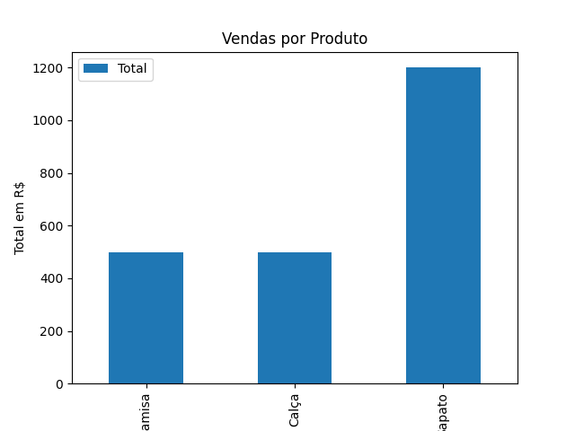

# Automação de Planilha de Vendas com Python 📊🐍

Projeto que lê dados de vendas em Excel, calcula totais por produto e gera gráfico de barras automaticamente usando **pandas** e **matplotlib**.

Ideal para automações de relatórios empresariais!

## ✨ Funcionalidades
- Cria planilha de exemplo automaticamente (caso não exista)
- Calcula valor total de cada produto e o total geral
- Gera gráfico de barras colorido
- Salva relatório atualizado e imagem do gráfico

## 🖼️ Resultado (gráfico gerado)



## 🚀 Como executar
```bash
pip install pandas openpyxl matplotlib
python main.py
